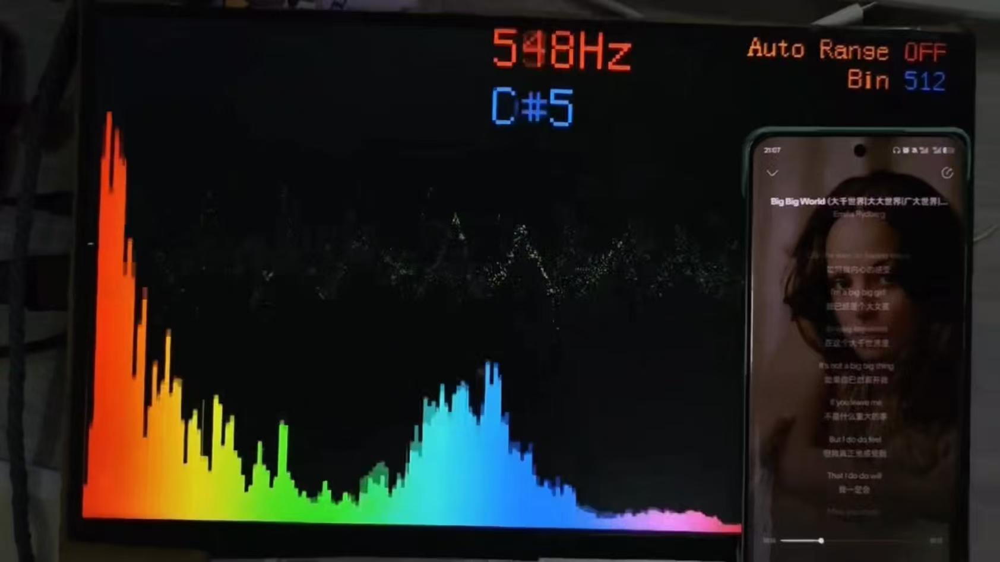

# FFT Spectrum Analyzer (FPGA)

一个基于 **Xilinx Artix-7 (XC7A35T-CSG324-1)** 的实时 FFT 频谱仪项目，使用 **Vivado** 工程，面向音频/低频信号的频谱分析与显示。

本项目适合作为：

* FPGA 数字信号处理（DSP）学习项目
* FFT / 频谱分析教学示例
* 音频频谱仪、音调检测、频率分析等应用的基础框架

<br>

## ✨ 项目特性

* 🎛 **实时 FFT 频谱处理**

  * 当前实现以 **512 点 FFT** 为主（`fft512_with_window.sv`）
  * 支持加窗处理（Hann Window）

* 🎧 **I2S 音频输入**

  * 适配 PCM1808 等常见音频 ADC
  * 稳健的 I2S 接收实现（`pcm1808_i2s_left16_robust.v`）

* 📊 **VGA 频谱显示输出**

  * 基于硬件 VGA 时序生成
  * 支持分辨率切换：

    * **1920×1080 @ 60Hz（1080p60）**
    * **1280×720 @ 30Hz（720p30）**（可扩展）
  * 柱状频谱渲染（`bar_render_pixel_sync.sv`）
  * 字符/注释显示（8×16 字模放大到 64×128）

* 🔁 **FFT 点数 / 显示模式配置**

  * 通过 `config_manager.sv` 统一管理参数
  * 支持 FFT 点数、显示模式、量程等配置切换

* 📐 **自动量程（Auto Scale）**

  * 根据当前频谱幅度自动调整显示增益
  * 避免强信号饱和或弱信号不可见

* 📈 **幅度与特征提取**

  * 幅度计算与缓存（`mag_ram_dp.sv`）
  * 峰值检测与音高估计（`pitch_detect_parabolic.sv`、`note_name_detect.sv`）

* ⌨️ **人机交互**

  * 按键去抖（`keys_debounce.sv`）
  * 数码管显示（`seg7_buffer.sv`）

<br>

## 🧱 硬件平台

* **开发板**：EGO1
* **FPGA**：Xilinx Artix-7 XC7A35T-CSG324-1
* **开发环境**：Vivado 2020.2 及以上
* **音频ADC**：pcm1808
* **时钟**：开发板上自带 100MHz 时钟源

<br>

## 📁 工程结构

````text
FFT_Spectrum_Analyzer/
├── rtl/                    # Verilog / SystemVerilog 源码
│   ├── top_fft_fpga.sv             # 顶层模块
│   ├── config_manager.sv           # 参数 / 模式配置管理
│   ├── i2s_clock_gen.v              # I2S 时钟生成
│   ├── pcm1808_i2s_left16_robust.v  # I2S 接收
│   ├── data_buffer_512.v            # 512 点数据缓存
│   ├── fft512_with_window.sv        # FFT + 加窗封装
│   ├── hann_window_coeff.sv         # Hann 窗系数
│   ├── mag_ram_dp.sv                # 幅度 RAM（双口）
│   ├── pitch_detect_parabolic.sv    # 抛物线插值音高检测
│   ├── note_name_detect.sv          # 音名识别
│   ├── bar_render_pixel_sync.sv     # 频谱柱状图渲染
│   ├── vga_1920x1080_60hz.sv        # VGA 时序（1080p60）
│   ├── font8x16_rom.sv              # 8×16 字模 ROM
│   ├── glyph_64x128_from_8x16.sv    # 字模放大
│   ├── keys_debounce.sv             # 按键去抖
│   └── seg7_buffer.sv               # 数码管显示
│
├── ip/                     # Vivado IP 核
│   ├── xfft_0.xci
│   ├── xfft_auto.xci
│   ├── clk_wiz_0.xci
│   └── clk_wiz_mclk.xci
│
├── constraints/            # 约束文件
│   └── ego1_constraints.xdc
│
├── scripts/                # Vivado Tcl 工程脚本
│   └── create_project.tcl
│
├── .gitignore
└── README.md
````
<br>

## 🧠 核心模块说明

| 模块名                  | 功能                 |
| -------------------- | ------------------ |
| `i2s_rx.v`           | I2S 音频接收，串并转换      |
| `hann_window.v`      | 汉宁窗系数生成            |
| `window_mul.v`       | 时域加窗               |
| `fft_frame_buffer.v` | FFT 帧缓存 / 对齐       |
| `FFT IP`             | Xilinx FFT IP Core |
| `fft_magnitude.v`    | 幅度计算（近似开方）         |
| `peak_detect.v`      | 频谱峰值检测             |
| `pitch_detect.v`     | 音高/主频估计            |
| `display_7seg.v`     | 数码管显示              |

<br>

## 📐 FFT 参数（示例）

* FFT 点数：512
* 采样率：48 kHz
* 频率分辨率：≈ 93.75 Hz/bin
* VGA输出：原波形、幅度频谱（线性）、峰值频率（HZ）、当前配置

<br>

## 🧪 测试


### 🧪 测试环境

- **开发板**：EGO1（Artix-7 XC7A35T-CSG324-1）
- **主时钟**：100MHz
- **Vivado 版本**：Vivado 2020.2 / 2021.1 / 2024.2（已验证）
- **输入信号源**：
    电脑耳机孔的模拟音频信号
- **音频ADC**：pcm1808
- **显示链路**：
  VGA to HDMI @1080p60
  
<br>



### 🧪 测试结果

**可以正常显示频谱，识别峰值频率、音调**

<br>


## 📌 TODO / 可扩展方向

* [ ] VGA / HDMI 频谱显示
* [ ] UART / USB 频谱数据输出
* [ ] 对数幅度 / dB 标定
* [ ] 多窗函数支持（Hamming / Blackman）
* [ ] 更高点数 FFT（1024 / 2048 / 4096）
* [ ] 输入波形采样加入过0采样

<br>

## 🚀 快速开始

### 1️⃣ 克隆仓库

```bash
git clone https://github.com/escape098/fft-spectrum-analyzer.git
cd fft-spectrum-analyzer
```

### 2️⃣ 启动 Vivado

```bash
vivado
```

### 3️⃣ 运行工程创建脚本

在 Vivado Tcl Console 中执行：

```tcl
cd scripts
source create_project.tcl
```

脚本将：

* 自动创建 Vivado 工程
* 设置 FPGA 型号 `xc7a35tcsg324-1`
* 添加 `rtl/`、`ip/`、`constrs/` 中的文件
* 设置顶层模块

> ⚠️ **注意**：IP 目录需完整保留，否则需要重新生成 FFT IP。

<br>

## 📜 开源许可（License）

本项目采用 **MIT License** 开源。

### 你可以做什么

在遵守 MIT License 条款的前提下，你可以：

* ✅ 自由使用本项目（个人 / 学术 / 商业用途均可）
* ✅ 修改、重构、裁剪或二次开发
* ✅ 将本项目集成到其他软硬件系统中
* ✅ 分发原项目或修改后的版本

### 你需要遵守的事项

* ❗ **必须在源代码或文档中保留原作者署名**
* ❗ **必须保留本项目的 License 文件**
* ❗ 若进行了修改，需明确标注修改内容（推荐但非强制）

### 免责声明

本项目按 **“现状（AS IS）”** 提供，不附带任何形式的明示或暗示担保。
作者不对因使用本项目而产生的任何直接或间接损失承担责任。

<br>

## 🙌 致谢

* 所有小组成员
* 开源 FPGA DSP 社区
* Xilinx FFT IP Core 文档

<br>

## 📬 联系方式

如有问题或建议，欢迎提交 Issue 或 Pull Request。


